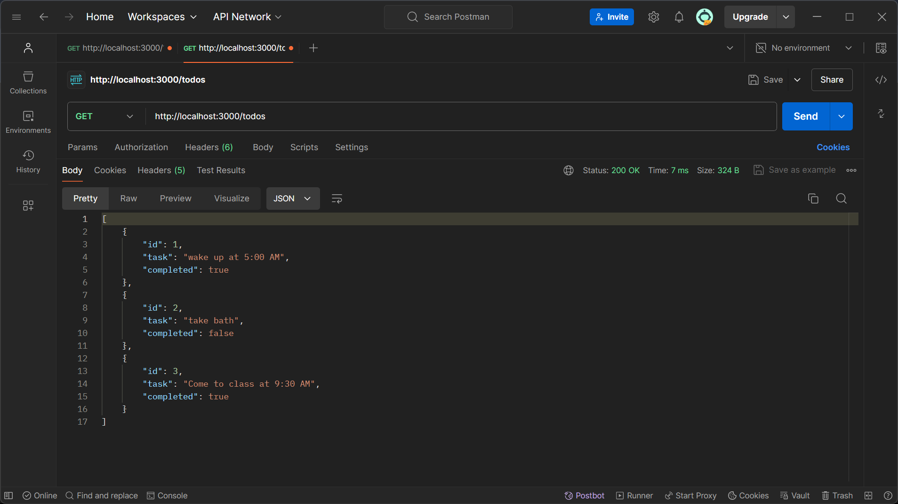
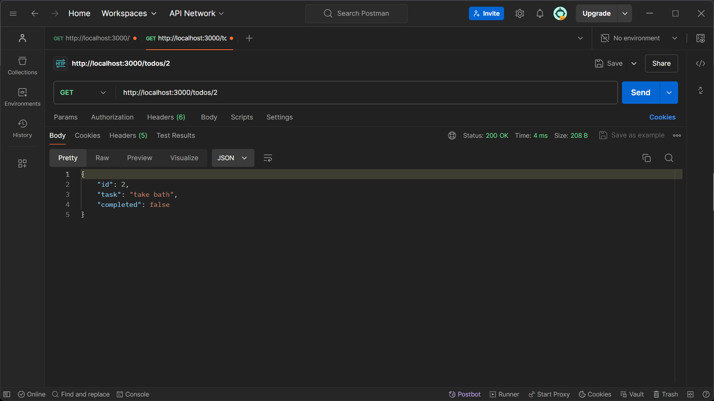
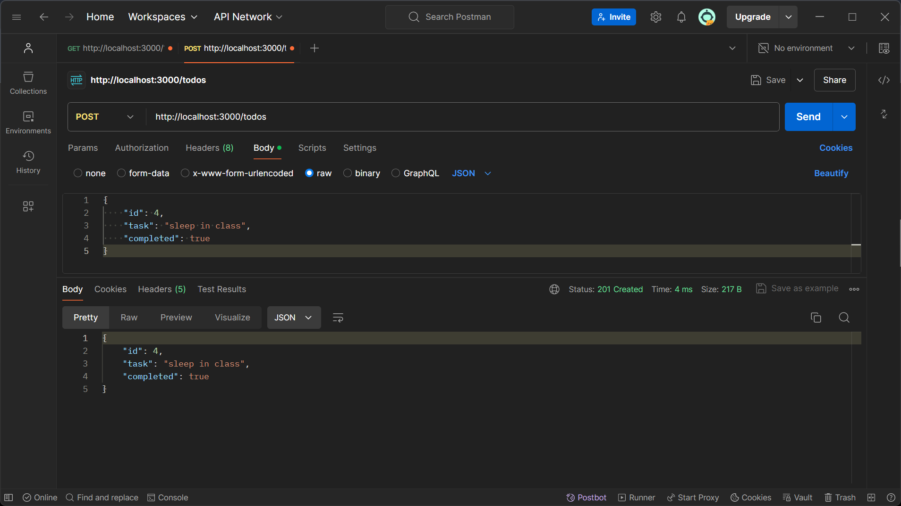
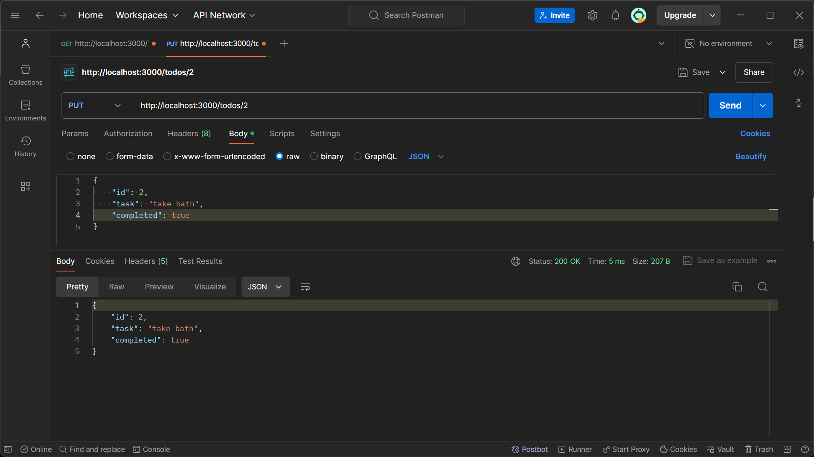
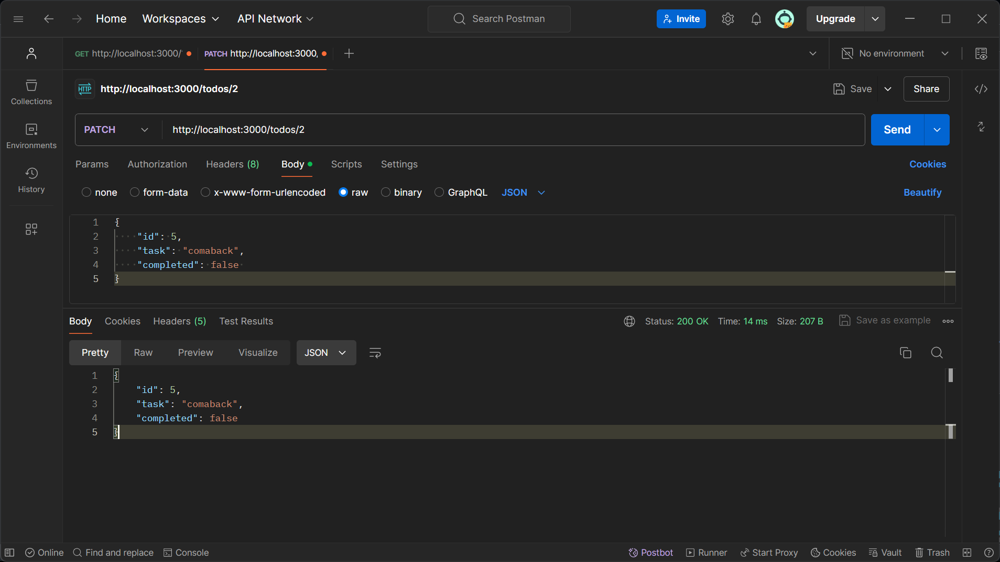
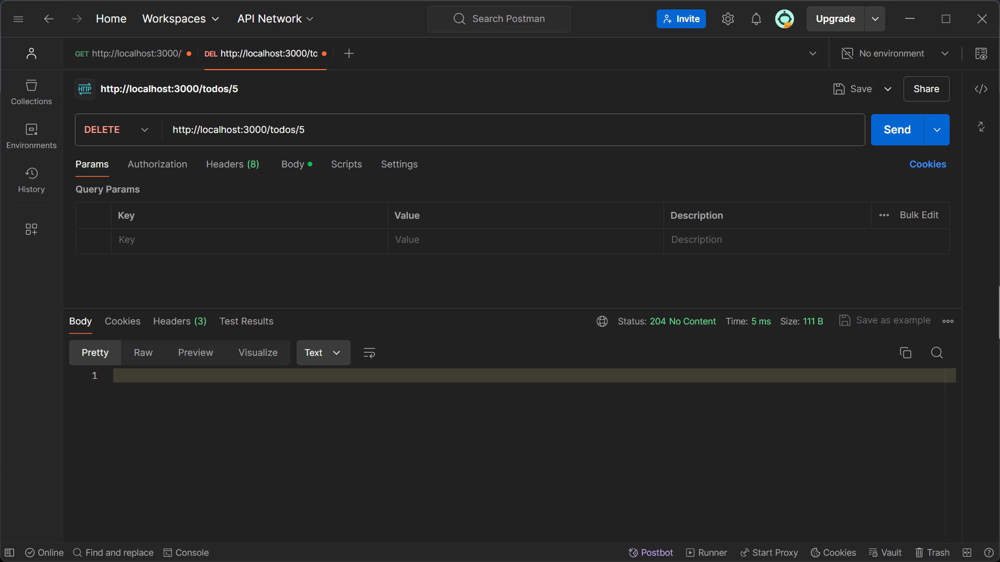

## Endpoints ##

## GET/todos ##

Description: Retrieve a list of all todos.

Request Method: GET

Response Status Codes:

200 OK: Successful retrieval of todos.

404 Not Found: No todos found.

## POST /todos

Description: Create a new todo.

Request Method: POST

Request Body: JSON object representing the new todo with 

the following properties:

task (string): The task description.

completed (boolean): Indicates whether the task is 

completed.

Response Status Codes:

201 Created: Todo created successfully.

405 Method Not Allowed: Unsupported request method.

## PUT /todos/:id ##

Description: Update an existing todo by its ID.

Request Method: PUT

Request Parameters: id (integer): The ID of the todo to be 

updated.

Request Body: JSON object containing the updated todo 

fields. Both task and completed fields are required.

Response Status Codes:

200 OK: Todo updated successfully.

404 Not Found: Todo with the specified ID not found.

405 Method Not Allowed: Unsupported request method.

## PATCH /todos/:id ##

Description: Partially update an existing todo by its ID.

Request Method: PATCH

Request Parameters: id (integer): The ID of the todo to be

updated.

Request Body: JSON object containing the fields to be

updated. Can include task, completed, or both.

Response Status Codes:

200 OK: Todo updated successfully.

404 Not Found: Todo with the specified ID not found.

405 Method Not Allowed: Unsupported request method.

## DELETE /todos/:id ##

Description: Delete a todo by its ID.

Request Method: DELETE

Request Parameters: id (integer): The ID of the todo to be

deleted.

Response Status Codes:

204 No Content: Todo deleted successfully.

404 Not Found: Todo with the specified ID not found.

